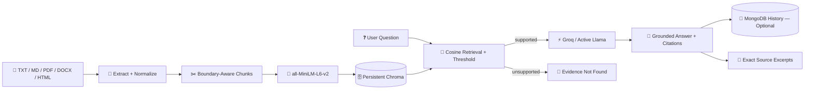

# 🏭 Plant Knowledge Copilot

<p align="center">
  <strong>Turn plant documents into evidence-grounded answers with source-level citations.</strong>
</p>

<p align="center">
  <a href="#-quick-start"><strong>🚀 Run Locally</strong></a>
  &nbsp;&nbsp;•&nbsp;&nbsp;
  <a href="#-system-architecture"><strong>🏗️ Architecture</strong></a>
  &nbsp;&nbsp;•&nbsp;&nbsp;
  <a href="#-testing--evaluation"><strong>🧪 Verification</strong></a>
  &nbsp;&nbsp;•&nbsp;&nbsp;
  <a href="docs/verification.md"><strong>📋 Evidence Record</strong></a>
</p>

<p align="center">


</p>

<p align="center">


</p>

---

## 💡 What is Plant Knowledge Copilot?

Plant Knowledge Copilot is a complete retrieval-augmented generation application for industrial document research. It ingests maintenance records, procedures, manuals, and saved web documents; converts them into a searchable local knowledge base; and generates answers grounded in exact retrieved excerpts.

The application is designed around one principle:

> **If the indexed documents do not support an answer, the copilot says so.**

It is a research and demonstration tool—not a maintenance authority, safety controller, or replacement for approved plant procedures and qualified personnel.

### ✨ Core capabilities

| Capability | Implementation |
|---|---|
| 📄 Multi-format ingestion | TXT, Markdown, text-based PDF, DOCX, and saved HTML |
| 🧹 Safe preprocessing | HTML cleanup, whitespace normalization, empty/malformed-file rejection |
| ✂️ Boundary-aware chunking | Configurable paragraph/sentence chunks with overlap |
| 🧠 Local embeddings | `sentence-transformers/all-MiniLM-L6-v2` |
| 🗄️ Persistent retrieval | Chroma with cosine similarity and explicit collection metadata |
| 🔁 Repeat-safe indexing | SHA-256 idempotency and changed-document replacement |
| 🔎 Evidence threshold | Configurable similarity cutoff; unsupported questions are declined |
| 💬 Grounded generation | Groq with an account-visible active generative Llama model |
| 🔗 Source citations | Numbered citations with exact excerpts, filenames, and PDF pages |
| 🛡️ Prompt-injection boundary | Retrieved documents are treated as untrusted quoted data |
| 🕘 Conversation history | MongoDB when configured; otherwise clearly labeled session-only history |

---

## 🔄 End-to-End RAG Workflow

```text
Plant Documents
TXT • MD • PDF • DOCX • HTML
        │
        ▼
Extract + Clean + Validate
        │
        ▼
Paragraph / Sentence-Aware Chunks
filename • page • chunk index • document hash
        │
        ▼
all-MiniLM-L6-v2 Embeddings
        │
        ▼
Persistent Chroma Collection
cosine similarity • model compatibility guard
        │
        ▼
Thresholded Retrieval
        │
        ├── No supporting evidence ──► Explicit unsupported answer
        │
        ▼
Groq + Active Llama Model
retrieved text is data, never instructions
        │
        ▼
Grounded Answer + [1] [2] Citations
        │
        ▼
Exact Evidence Excerpts
```

---

## 🏗️ System Architecture



### 🔐 Trust boundaries

| Boundary | Protection |
|---|---|
| Uploaded documents | Treated as untrusted content, never application instructions |
| Retrieved passages | Delimited as quoted evidence inside the generation prompt |
| Embedding compatibility | Collection stores model and distance metadata; incompatible settings fail fast |
| Unsupported questions | No qualifying retrieval means no LLM call and an explicit unsupported response |
| Credentials | Environment variables only; `.env` and Streamlit secrets are ignored |
| Industrial decisions | Human-approved procedures and qualified personnel remain authoritative |

---

## 📚 Supported Data Sources

| Format | Extraction behavior | Preserved metadata |
|---|---|---|
| 📝 TXT | UTF-8 text with normalized whitespace | Filename |
| 📘 Markdown | Readable text with paragraph structure | Filename |
| 📕 PDF | Page-by-page text extraction | Filename + 1-based page number |
| 📄 DOCX | Paragraph extraction | Filename |
| 🌐 HTML | Removes scripts, styles, navigation, headers, footers, and SVG | Filename |

> **Scanned PDFs require OCR before upload.** Image-only pages do not contain extractable text and are rejected with a useful message.

The repository includes four files under `demo_data/`. Every example is visibly marked **SYNTHETIC** and must not be interpreted as verified industrial guidance.

---

## 🧠 Knowledge Base Design

### Explicit vector configuration

```text
Embedding model   sentence-transformers/all-MiniLM-L6-v2
Distance metric   cosine
Collection        plant_knowledge_v1
Default chunk     900 characters
Default overlap   120 characters
Top-K             5
Default threshold 0.50
```

### 🔁 Idempotency and replacement

```text
Upload file
   │
   ▼
Calculate SHA-256
   │
   ├── Same filename + same hash ──► UNCHANGED
   │
   └── Same filename + new hash
                 │
                 ▼
         Replace earlier chunks
```

Every stored chunk carries its filename, PDF page where applicable, source hash, chunk index, and embedding-model identifier.

---

## 🖥️ Application Experience

The Streamlit interface provides:

- 📤 Multi-document upload and indexing
- 🎛️ Configurable chunk size and overlap
- 📦 One-click indexing of bundled synthetic examples
- 📊 Indexed-chunk count
- 💬 Evidence-grounded chat
- 🔍 Expandable numbered evidence excerpts
- 📄 Filename and PDF-page citation metadata
- 🆕 New-conversation control
- 🕘 Durable MongoDB or clearly labeled session-only history
- ⚠️ Visible synthetic-data and industrial-safety notices

### 🎮 Demo flow

```text
Index bundled synthetic examples
             │
             ▼
Ask: What vibration was recorded after maintenance on Pump P-101?
             │
             ▼
Retrieve SYNTHETIC_pump_alpha_maintenance.md
             │
             ▼
Generate a grounded answer with [1]
             │
             ▼
Expand [1] to inspect the exact source excerpt
```

---

## 🛠️ Technology Stack

<p align="center">


</p>

| Layer | Technology | Purpose |
|---|---|---|
| 🖥️ Interface | Streamlit | Upload, indexing, chat, and evidence inspection |
| 🧹 Extraction | PyPDF, python-docx, Beautiful Soup | Format-specific readable-text extraction |
| 🧠 Embeddings | Sentence Transformers | Local semantic vectors using MiniLM |
| 🗄️ Vector store | Chroma | Persistent cosine-similarity retrieval |
| ⚡ Generation | Groq SDK | Fast hosted Llama inference when configured |
| 🍃 History | MongoDB / PyMongo | Optional durable conversation records |
| 🧪 Quality | Pytest + Ruff | Functional tests and static checks |
| 📦 Packaging | Docker | Reproducible application container |
| 🔄 CI | GitHub Actions | Install, lint, and test on every push/PR |

---

## 🚀 Quick Start

### Prerequisites

- Python 3.11 or 3.12
- Git
- A Groq API key for answer generation
- Optional MongoDB connection for durable chat history

### 1️⃣ Clone and create an environment

```powershell
git clone https://github.com/Janicebenita/plant-knowledge-copilot-rag.git
cd plant-knowledge-copilot-rag
python -m venv .venv
.\.venv\Scripts\Activate.ps1
```

macOS or Linux:

```bash
source .venv/bin/activate
```

### 2️⃣ Install dependencies

```powershell
python -m pip install --upgrade pip
python -m pip install -r requirements-dev.txt
```

> The first application start downloads the MiniLM model weights from Hugging Face. Later starts use the local model cache.

### 3️⃣ Configure environment variables

```powershell
Copy-Item .env.example .env
```

Add your own values to `.env`:

```env
GROQ_API_KEY=your_key_here
GROQ_MODEL=an_active_generative_llama_model_for_your_account

# Optional
MONGODB_URI=
MONGODB_DATABASE=plant_knowledge_copilot
```

Model availability changes over time. Select `GROQ_MODEL` from the authenticated Groq Models API response. The application validates availability and Llama identity instead of silently relying on a retired model.

### 4️⃣ Start the application

```powershell
streamlit run app.py
```

Open `http://localhost:8501`, click **Index bundled synthetic examples**, then ask:

```text
What vibration was recorded after maintenance on Pump P-101?
```

---

## ⚙️ Configuration Reference

| Variable | Default | Purpose |
|---|---:|---|
| `GROQ_API_KEY` | none | Required for generated answers |
| `GROQ_MODEL` | none | Active generative Llama model visible to the Groq account |
| `MONGODB_URI` | none | Optional durable conversation history |
| `MONGODB_DATABASE` | `plant_knowledge_copilot` | MongoDB database name |
| `CHROMA_PATH` | `./chroma_db` | Persistent vector database directory |
| `CHROMA_COLLECTION` | `plant_knowledge_v1` | Versioned collection name |
| `EMBEDDING_MODEL` | `sentence-transformers/all-MiniLM-L6-v2` | Embedding model identity |
| `CHUNK_SIZE` | `900` | Target chunk size in characters |
| `CHUNK_OVERLAP` | `120` | Overlap between neighboring chunks |
| `RELEVANCE_THRESHOLD` | `0.50` | Minimum cosine similarity accepted |
| `TOP_K` | `5` | Maximum retrieved passages |

---

## 🧪 Testing & Evaluation

```powershell
python -m pytest
ruff check .
```

The quality suite covers extraction, malformed uploads, chunk boundaries and metadata, idempotency, changed-document replacement, retrieval, threshold rejection, unsupported answers, and retrieved-text prompt injection.

Run the reproducible retrieval evaluation after indexing the examples:

```powershell
python evaluate.py
```

The evaluation set lives in `evaluation/questions.json` and records expected source filenames plus reference facts.

> **Evaluation honesty:** `evaluate.py` reports retrieval success separately. It does not claim that an LLM answer is factually correct, stylistically strong, or production-ready.

### ✅ Verified implementation status

| Check | Result |
|---|---|
| Ruff static checks | ✅ Passed |
| Unit/integration tests | ✅ 12 passed |
| GitHub Actions | ✅ Passed |
| Real MiniLM model load | ✅ Verified |
| Persistent Chroma ingestion | ✅ Verified |
| Bundled retrieval evaluation | ✅ 3/3 |
| Streamlit health endpoint | ✅ HTTP 200 |
| Browser render and controls | ✅ Verified |
| Bundled-example indexing in UI | ✅ Verified |
| Groq answer generation | ⚪ Not tested — credentials unavailable |
| MongoDB durable history | ⚪ Not tested — credentials unavailable |

See [`docs/verification.md`](docs/verification.md) for the exact verification record and limitations.

---

## 🐳 Deployment

### Local Docker deployment

```powershell
docker build -t plant-knowledge-copilot .
docker run --rm `
  -p 8501:8501 `
  --env-file .env `
  -e CHROMA_PATH=/data/chroma `
  -v plant-kb:/data `
  plant-knowledge-copilot
```

### ☁️ Managed deployment checklist

1. 🔐 Store `GROQ_API_KEY` and optional `MONGODB_URI` in the platform secret manager.
2. 📦 Attach persistent writable storage and point `CHROMA_PATH` to that volume.
3. 🧠 Ensure the runtime can download or package the MiniLM model weights.
4. 👤 Add authentication before accepting private plant documents.
5. 🔒 Define upload authorization, retention, backup, and deletion policies.
6. 📊 Health-check `/_stcore/health`.
7. 🗄️ Use one writer or a shared vector service for multi-replica deployment.

> **Ephemeral filesystem warning:** without a persistent volume, the local Chroma database disappears on restart or redeployment. MongoDB preserves conversation messages only; it does not preserve the vector database.

---

## 📁 Repository Structure

```text
plant-knowledge-copilot-rag/
│
├── app.py                         # Streamlit application
├── evaluate.py                    # Retrieval-only evaluation runner
├── Dockerfile                     # Reproducible container
├── .env.example                   # Safe configuration template
│
├── plant_copilot/
│   ├── answering.py               # Grounded prompt + Groq client
│   ├── chunking.py                # Boundary-aware chunking
│   ├── config.py                  # Explicit runtime settings
│   ├── extract.py                 # Multi-format preprocessing
│   ├── history.py                 # Optional MongoDB history
│   └── knowledge.py               # Chroma ingestion and retrieval
│
├── demo_data/                     # Clearly labeled synthetic records
├── evaluation/questions.json      # Reproducible retrieval cases
├── tests/                         # Functional quality suite
├── docs/
│   ├── architecture.md
│   ├── verification.md
│   └── assets/plant-knowledge-copilot-hero.png
└── .github/workflows/test.yml     # GitHub Actions CI
```

---

## 🛡️ Security & Data Handling

- Never commit `.env`, API keys, MongoDB credentials, or Streamlit secrets.
- Never commit uploaded private plant records.
- Never commit the local Chroma database or model cache.
- Use access controls before deploying for multiple users.
- Treat retrieved documents as untrusted content.
- Review retention and deletion requirements for indexed records.
- Keep source-system permissions and plant document classifications authoritative.

The included `.gitignore` excludes credentials, virtual environments, uploaded records, model caches, logs, and local vector data.

---

## ⚠️ Scope & Limitations

Plant Knowledge Copilot is an educational and research implementation, not a certified industrial decision system.

- Bundled records are synthetic and not verified industrial guidance.
- Scanned PDFs require an external OCR step.
- Retrieval relevance must be recalibrated for each real corpus.
- A citation proves which passage was retrieved, not that an interpretation is correct.
- LLM output requires human review against approved source documents.
- MongoDB is optional and does not replace persistent vector storage.
- No production execution, control, approval, or maintenance action capability is included.

---

## 🔗 Quick Links

| Resource | Link |
|---|---|
| 💻 Source repository | https://github.com/Janicebenita/plant-knowledge-copilot-rag |
| 🏗️ Architecture | [`docs/architecture.md`](docs/architecture.md) |
| 📋 Verification record | [`docs/verification.md`](docs/verification.md) |
| 🧪 Evaluation set | [`evaluation/questions.json`](evaluation/questions.json) |
| 📦 Synthetic demo corpus | [`demo_data/`](demo_data/) |

---

## ✅ Project Status

```text
Multi-format extraction          ✅
Boundary-aware chunking          ✅
MiniLM embeddings                ✅
Persistent Chroma storage        ✅
Idempotent document ingestion    ✅
Changed-document replacement     ✅
Thresholded semantic retrieval   ✅
Grounded Groq generation path    ✅
Numbered source evidence         ✅
Prompt-injection boundary        ✅
Optional MongoDB history         ✅
Synthetic demo corpus            ✅
Automated tests                  ✅
GitHub Actions                   ✅
Docker deployment path           ✅
Production action capability     ❌ Not included by design
```

<p align="center">
  <strong>🏭 PLANT KNOWLEDGE COPILOT</strong>
</p>

<p align="center">
  Search precisely • Answer with evidence • Keep humans authoritative
</p>

<p align="center">
  <a href="#-quick-start"><strong>🚀 Run Plant Knowledge Copilot</strong></a>
  &nbsp;&nbsp;•&nbsp;&nbsp;
  <a href="docs/verification.md"><strong>📋 Review Verification Evidence</strong></a>
</p>
