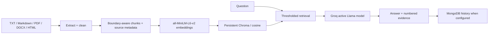

# Architecture

Trust boundaries: uploads and retrieved text are untrusted data. The system prompt prohibits following instructions found in retrieved text. Chroma collection metadata pins the embedding model and cosine distance; startup refuses a conflicting existing collection.

